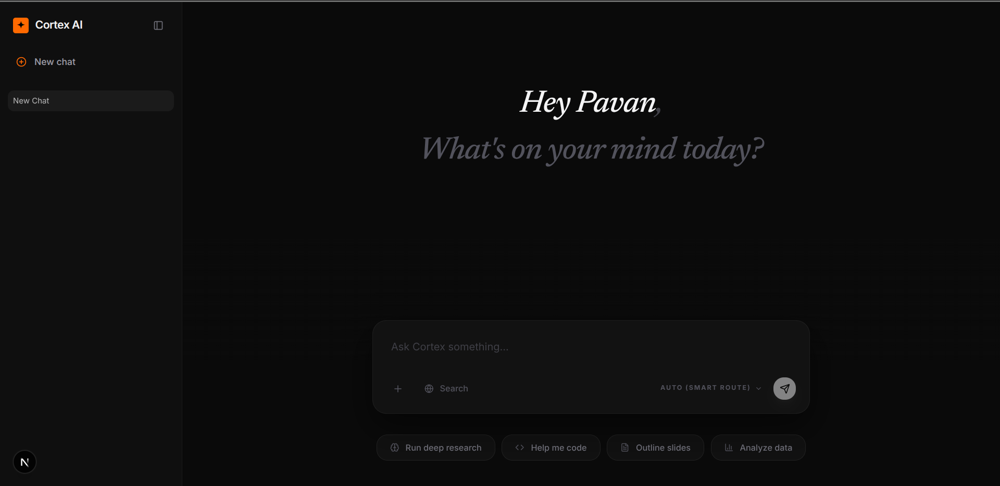

# Cortex AI 



Cortex AI is a high-performance, event-driven chatbot application built with Next.js 16, designed for high-scale AI observability. It features a decoupled telemetry pipeline that ingests inference data into ClickHouse via Kafka, ensuring the core chat experience remains fast and reliable.

## 📋 Prerequisites

Before starting, ensure you have the following installed:
- **Node.js** (v20 or higher)
- **Docker & Docker Compose** (for Kafka and ClickHouse)
- A **Groq API Key** (Get one at [console.groq.com](https://console.groq.com))

## 🚀 Quick Start

Follow these steps to get Cortex AI running on your machine:

### 1. Clone & Install
```bash
git clone https://github.com/pavankotti/cortex-ai.git
cd cortex-ai
npm install
```

### 2. Infrastructure (Kafka & ClickHouse)
Spin up the analytical engines using Docker:
```bash
docker-compose up -d
```

### 3. Environment Setup
Create a `.env` file in the root directory and add your keys. 
*Note: `dev.db` is a local SQLite file that Prisma will create and manage for you automatically.*
```env
GROQ_API_KEY=gsk_...
DATABASE_URL="file:./dev.db"
```

### 4. Initialize Data Layers
This syncs your local SQLite schema and initializes the ClickHouse telemetry tables:
```bash
# Sync SQLite (Application State)
npx prisma db push

# Sync ClickHouse & Kafka (Telemetry)
npm run db:init
```

### 5. Run the System
You need **two** terminal windows:

**Terminal 1 (Ingestion Worker):**
```bash
npm run ingest
```

**Terminal 2 (Web App):**
```bash
npm run dev
```
Visit [http://localhost:3000](http://localhost:3000) to start chatting!

## 📊 Monitoring & Dashboards

Cortex AI comes with pre-configured monitoring via Grafana.

1. **Access Grafana:** [http://localhost:3001](http://localhost:3001)
2. **Login:** User: `admin` / Password: `admin`
3. **Data Source:** The ClickHouse data source is automatically provisioned.

### Persisting your Dashboards
To ensure your dashboards are saved in the repository and available to others:
1. Open your dashboard in Grafana.
2. Go to **Dashboard Settings** (gear icon) -> **JSON Model**.
3. Copy the entire JSON.
4. Create a new file (e.g., `telemetry.json`) in the `/grafana/dashboards/` directory of this project.
5. Paste the JSON there.
6. Next time you run `docker-compose up`, the dashboard will be automatically imported!

---
Built with Groq, Vercel AI SDK, Prisma, and ClickHouse.
For technical details, see [ARCHITECTURE.md](./ARCHITECTURE.md).
